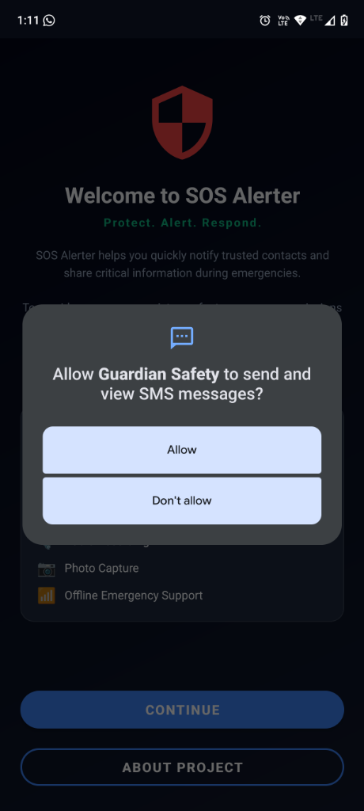
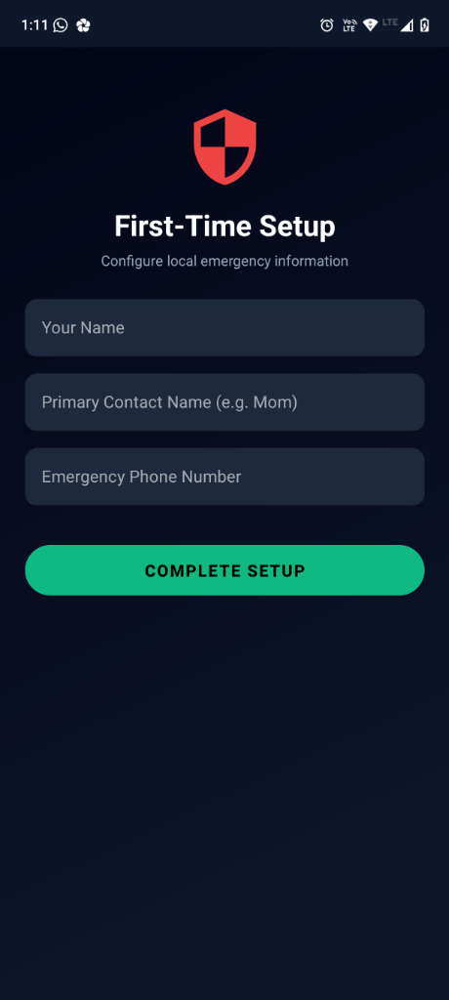
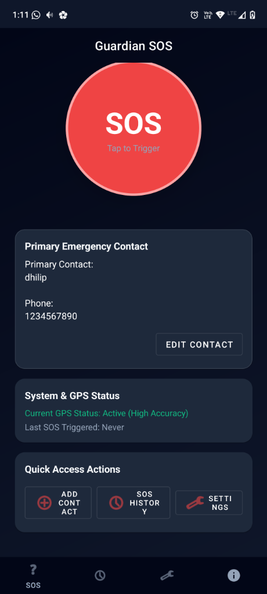
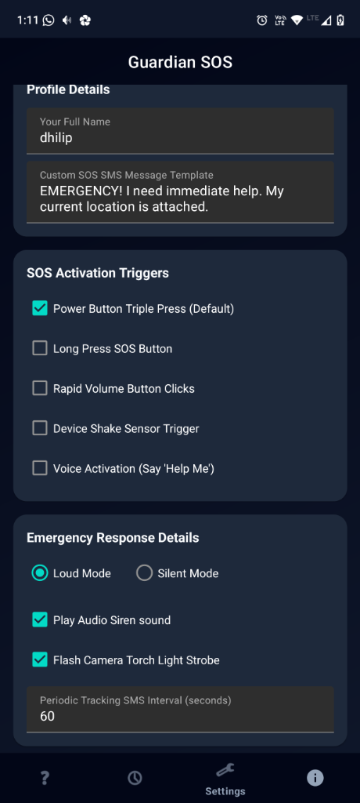

<p align="center">
  
</p>

<h1 align="center">SOS Alerter</h1>

<p align="center">
  <strong>Protect. Alert. Respond.</strong>
</p>

<p align="center">
  Modern, privacy-focused emergency assistance application for Android.
</p>

<p align="center">
  <a href="https://github.com/dhilipmpms/SOS-alerter/releases"></a>
  <a href="LICENSE"></a>
  
  
</p>

---

## 📱 Screenshots

Arrange and preview the main screens of SOS Alerter:

| **Welcome & Permissions** | **First-Time Setup** |
| :---: | :---: |
|  |  |
| *Welcome Onboarding & Permission Explanation Dialog* | *Primary Contact & Owner Profile Registration* |

| **Home Screen** | **Settings Panel** |
| :---: | :---: |
|  |  |
| *SOS Button, GPS Tracking Status, and Quick Actions* | *SOS Activation Triggers & Alarm Settings Configuration* |

---

## ✨ Features

Every feature listed below currently exists in the codebase and is fully functional.

### 🚨 Emergency Actions
* **Emergency SMS Alerts**: Automatically dispatches a formatted emergency alert SMS to your primary emergency contact.
* **GPS Location Sharing**: Fetches and appends high-accuracy GPS coordinates to your emergency SMS message.
* **Emergency Direct Dialing**: Initiates an automated phone call to your emergency contact or local emergency line.
* **Live Location Tracking**: Continuously updates emergency contacts with real-time GPS locations via SMS at customizable tracking intervals (e.g., every 60 seconds).
* **Audio Evidence Recording**: Silently records audio evidence locally via the device's microphone during an active emergency.
* **Evidence Photo Capture**: Captures photos silently using the front and back cameras and stores them securely on internal storage.
* **Loud Siren Alarm**: Sounds a loud, high-pitched emergency siren to alert nearby bystanders.
* **Strobe Flashlight**: Flashes the camera torch continuously as a distress signal to improve nighttime visibility.
* **Loud & Silent Modes**: Fully configurable to trigger silently (stealth mode) or loudly depending on the threat scenario.

### ⚡ SOS Activation Triggers
* **Power Button Triple Press**: Press the hardware power button three times in rapid succession.
* **Long Press SOS Button**: Press and hold the main interface button.
* **Rapid Volume Button Clicks**: Press volume buttons in rapid succession.
* **Device Shake Trigger**: Shake your device to automatically initialize countdown/alerts using the accelerometer sensor.
* **Voice Activation**: Say the trigger phrase **"Help Me"** to trigger hands-free assistance.

---

## 🛠 Building From Source

Follow these steps to compile and package the app manually.

### Requirements
* **Android Studio** (Flamingo or later recommended)
* **Android SDK** (API level 34)
* **Java Development Kit (JDK 17)** or higher
* **Gradle 8.0+**

### Build Steps

1. **Clone the Repository**:
   ```bash
   git clone https://github.com/dhilipmpms/SOS-alerter.git
   cd SOS-alerter
   ```

2. **Open in Android Studio**:
   - Open Android Studio.
   - Select **File > Open** (or **Open an Existing Project**).
   - Navigate to the cloned folder and select it.

3. **Sync Gradle**:
   - Android Studio will automatically index files and sync dependencies. 
   - If needed, manually select **File > Sync Project with Gradle Files**.

4. **Build APK**:
   - To build the debug package, navigate to **Build > Build Bundle(s) / APK(s) > Build APK(s)**.
   - Alternatively, build from the command line using:
     ```bash
     ./gradlew assembleDebug
     ```

5. **Run the Application**:
   - Connect an Android device with USB debugging enabled, or launch an AVD emulator.
   - Click the green **Run** button in Android Studio, or install the compiled APK via terminal:
     ```bash
     ./gradlew installDebug
     ```

---

## 📦 Installation

To download and install the app directly on your Android device:

1. Download the latest compiled `.apk` file from the [Releases](https://github.com/dhilipmpms/SOS-alerter/releases) section.
2. Enable installation from unknown sources in your Android settings.
3. Open the downloaded `.apk` file and tap **Install**.

---

## 🔒 Permissions

SOS Alerter is privacy-first, requesting only the permissions necessary to ensure safety features can function reliably in the background:

* **Location (`ACCESS_FINE_LOCATION`, `ACCESS_COARSE_LOCATION`)**: Retrieves high-accuracy GPS coordinates to send to your emergency contacts.
* **SMS (`SEND_SMS`)**: Sends automated SMS alerts and location tracking updates to your contacts.
* **Phone (`CALL_PHONE`)**: Initiates direct calls to your emergency contact or local authorities.
* **Camera (`CAMERA`)**: Captures silent evidence photographs via front/back camera sensors.
* **Microphone (`RECORD_AUDIO`)**: Enables offline voice trigger detection ("Help Me") and local evidence recording.
* **Notifications (`POST_NOTIFICATIONS`)**: Keeps the background monitoring service running reliably via a persistent system notification.

---

## 🛡 Privacy Policy

* **Zero Advertisements**: The application does not contain ads or sponsored trackers.
* **No Telemetry / Analytics**: We do not collect, aggregate, or upload user usage details, crash reports, or personal data.
* **Offline-First Design**: The application functions entirely offline. SMS and calling rely purely on standard cellular network services.
* **Local Data Storage**: All emergency contacts, credentials, photos, and audio files are stored securely on the device's internal storage and never leave the device.

---

## 🗺 Roadmap

Features currently planned for future releases:

* [ ] **End-to-End Encrypted Cloud Sync** (Optional backup for logs/settings)
* [ ] **Wear OS Smartwatch Companion App**
* [ ] **Multi-Language Offline Localization**
* [ ] **Customizable Home Screen Widgets**

---

## 📄 License

This project is licensed under the **GNU GPL-3.0 License**. See the [LICENSE](LICENSE) file for details.

---

## 👥 Credits

### Created and Maintained by
* **Dhilip S**
  * Software Engineering Student
  * Linux User
  * FOSS Activist
  * Open Source Contributor
  * **GitHub**: [@dhilipmpms](https://github.com/dhilipmpms)

---

## 🤝 Contributing

Contributions of any kind are welcome! Please read our [CONTRIBUTING.md](CONTRIBUTING.md) to understand project standards, setup steps, and formatting guidelines.

---

## 💬 Support

* **Bug Tracking**: Please open bug reports and issue submissions via [GitHub Issues](https://github.com/dhilipmpms/SOS-alerter/issues).
* **Community Help**: Join community discussions and request help on [GitHub Discussions](https://github.com/dhilipmpms/SOS-alerter/discussions).

---

## ❤️ Acknowledgements

* **Free Software Community**
* **Android Open Source Ecosystem**
